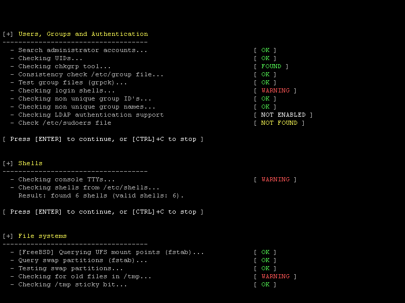

:source-highlighter: coderay
:revealjs_theme: solarized

:numbered:

= et si on sécurisait nos PC ?

(et Romain travaillerait sa concentration)

== pourquoi ?

[%step]
- parce qu'on peut/doit
- parce que l'attaque se fera sur le maillon faible
- parce que la majeure partie du piratage vient de l'intérieur
image:img/thief.gif[thief]

== à quel point ?

La sécurisation d'un ordinateur nécessite l'évaluation de la menace et du risque, et l'établissement d'une solution mesurée.

image:img/trust.gif[trust]

=== Difficile d'évaluer la menace et le risque

Un employé oublie son ordinateur portable dans le tram...

[%step]
* Son disque était-il chiffré ?
* Si non, ses clefs SSH sont disponibles ?
* Son script d'accès au VPN (sans double authentification) ?
* A quelle plateforme a-t-il accès ?
* Ne vient il pas de donner un accès libre à toutes nos plateformes client et à notre SI ?

=== Alors que le coût...

Ce n'est pas si difficile que ça, une étape à la fois.

== comment ?

=== rendre illisible

- chiffrer les données stockées
- chiffrer les données transmises

=== réduire la surface d'attaque

Plus on laisse de portes ouvertes...

image:img/open.gif[open]

=== n'exposer que le nécéssaire

[source]
----
nmap -p 1-65535 10.33.1.62

Starting Nmap 7.40 ( https://nmap.org ) at 2017-02-05 01:24 CET
Nmap scan report for 10.33.1.62
Host is up (0.000043s latency).
Not shown: 65534 closed ports
PORT   STATE SERVICE
22/tcp open  ssh

Nmap done: 1 IP address (1 host up) scanned in 0.65 seconds
----

=== exhibitionniste

[source]
----
nmap -p 1-65535 10.33.1.38

Starting Nmap 7.40 ( https://nmap.org ) at 2017-02-06 09:53 CET
Nmap scan report for 10.33.1.38
Host is up (0.00077s latency).
Not shown: 65524 closed ports
PORT      STATE SERVICE
22/tcp    open  ssh
53/tcp    open  domain
111/tcp   open  rpcbind
139/tcp   open  netbios-ssn
445/tcp   open  microsoft-ds
631/tcp   open  ipp
3000/tcp  open  ppp
4713/tcp  open  pulseaudio
6660/tcp  open  unknown
17500/tcp open  db-lsp
35323/tcp open  unknown

Nmap done: 1 IP address (1 host up) scanned in 0.66 seconds
----

== mot de passe (something you know)

La première chose que l'on rencontre quand on veut se connecter à un PC ou un site web

image:img/pass.gif[pass]

=== choix

image:img/xkcd.png[password strength,link=https://xkcd.com/936/]

=== stockage des mots de passe

On écarte la solution du post-it sur le côté de l'écran.
image:img/postit.jpg[password post-it]

[%step]
- http://keepass.info/
- https://www.lastpass.com/fr
- https://lesspass.com/
- https://www.passwordstore.org/
- https://products.office.com/fr-fr/excel

=== Une clef par porte

Un mot de passe qui n'accède qu'à une chose, c'est moins dangereux quand c'est compromis.

=== sauvegarde

Pour les solutions locales, il FAUT sauvegarder

D'une manière générale, il faut sauvegarder

(et sécuriser les sauvegardes)

== stockage

=== préparation habituelle d'un disque

[source]
----
parted -s /dev/sda mklabel msdos
parted -s /dev/sda mkpart primary 2048s 100M
parted -s /dev/sda mkpart extended 101M 100%
parted -s /dev/sda mkpart logical 0 100M
parted -s /dev/sda mkpart logical 101 2048M
parted -s /dev/sda mkpart logical 2049 4196M
...
mkfs.ext4 /dev/sda1
mkfs.ext4 /dev/sda2
mkfs.ext4 /dev/sda3
mkfs.ext4 /dev/sda4
mount /dev/sda3 /
mount /dev/sda1 /boot
mount /dev/sda2 /tmp
mount /dev/sda4 /var
...
----

=== one file system to store them all

Un PC n'est pas un serveur.

=== luks

[source]
----
parted -s /dev/sda mklabel msdos
parted -s /dev/sda mkpart primary 2048s 100%
cryptsetup -s 512 -h sha512 luksFormat /dev/sda1
cryptsetup open /dev/sda1 hdd
mkfs.ext4 /dev/mapper/hdd
mount /dev/mapper/hdd /mnt
----

=== swap

Swapfile.

[source]
----
fallocate -l 8G /swapfile
chmod 600 /swapfile
mkswap /swapfile
swapon /swapfile
echo -e "/swapfile\tnone\tdefaults\t0 0" >> /etc/fstab
----

=== dd avant luks

Avant de chiffrer un disque pas neuf, il faut l'écraser :

 dd if=/dev/zero of=/dev/sda bs=10M

=== fichier clef

- 7 slots par luks
- peuvent être une passphrase, mais aussi un fichier
- fichier clef sur clef usb ? non.
- fichier clef sur la partition luks ? oui.

=== grub

Deux lignes ajoutées :

[source]
----
GRUB_ENABLE_CRYPTODISK=y
GRUB_CMDLINE_LINUX="cryptdevice=/dev/disk/by-uuid/12345678-90ab-cdef-1234-567890abcdef:hdd resume=/dev/mapper/hdd resume_offset=102400"
----

102400 ?

[source]
----
filefrag -v /swapfile
----

=== permissions, umask ou les limites du least privilege

[source]
----
umask 077
----

mauvaise idée.

image:img/badperm.gif[bad idea]

== environnement graphique

=== Un bon PC est un PC locké.

- xscreensaver
- xautolock

=== Un bon PC est un PC éteind.

hiberner, eteindre, ne pas suspendre

image:img/sleep.gif[sleep]

=== ne traitez pas votre Linux comme un Windows

- Limitez le nombre de paquets installés
- Connaissez-les

video::img/toomuch.mp4[options="autoplay,loop"]

== réseau

=== IPv6 or not IPv6 ?

not.

video::img/shut.mp4[options="autoplay,loop"]

=== ssh

- Pas de connexion en root ? Non
- Pas de connexion par mot de passe ? Si
- Pas de connexion du tout ? Si

[source]
----
AddressFamily inet
PermitRootLogin no
----

=== pam_ssh

Ou comment avoir une passphrase sans la taper

Configuration dans /etc/pam.d/login :
[source]
----
auth       optional     pam_ssh.so try_first_pass
session    optional     pam_ssh.so
----

=== configuration noyau

[source]
----
net.ipv6.conf.all.disable_ipv6=1
net.ipv4.conf.all.forwarding=1
net.ipv4.ip_forward=1
net.ipv4.conf.all.log_martians=1
net.ipv4.tcp_syncookies=1
net.ipv4.tcp_rfc1337=1
net.ipv4.conf.all.rp_filter=1
net.ipv4.tcp_timestamps=0
net.ipv4.icmp_echo_ignore_broadcasts=1
net.ipv4.icmp_ignore_bogus_error_responses=1
net.ipv4.conf.all.send_redirects=0
----

=== firewall

(extrait)
[source]
----
-I TCP -p tcp -m recent --update --seconds 60 --name TCP-PORTSCAN -j REJECT --reject-with tcp-rst
-I UDP -p udp -m recent --update --seconds 60 --name UDP-PORTSCAN -j REJECT --reject-with port-unreach
-A INPUT -p icmp -j DROP
-A INPUT -p udp -m recent --set --name UDP-PORTSCAN -j REJECT --reject-with icmp-port-unreach
-A INPUT -p tcp -m recent --set --name TCP-PORTSCAN -j REJECT --reject-with tcp-rst
----

(complet)

https://github.com/n0vember-/ansible-role-network/blob/master/files/etc/iptables/iptables.rules

=== DNS

https://freedns.zone/en/

== autre chose ?

=== modules

[source]
----
blacklist firewire_core
----

Désactiver l'USB ?

== et le bios ?

- Mot de passe
- Desactivation du boot sur USB
- Mot de passe pour changer l'ordre de boot

== et le boot loader ?

Vous avez un TPM, utilisez Trusted Grub.

=== sans trusted grub

[source]
----
    # cat /sys/devices/pnp0/00:09/pcrs 
    PCR-00: A8 5A 84 B7 38 FC C0 CF 3A 44 7A 5A A7 03 83 0B BE E7 BD D9 
    PCR-01: 11 40 C1 7D 0D 25 51 9E 28 53 A5 22 B7 1F 12 24 47 91 15 CB 
    PCR-02: A3 82 9A 64 61 85 2C C1 43 ED 75 83 48 35 90 4F 07 A9 D5 2C 
    PCR-03: B2 A8 3B 0E BF 2F 83 78 29 9A 5B 2B DF C3 1E A9 55 AD 72 36 
    PCR-04: 78 93 CF 58 0E E1 A3 8F DA 6F E0 3B C9 53 76 28 12 93 EF 82 
    PCR-05: 72 A7 A9 6C 96 39 38 52 D5 9B D9 12 39 75 86 44 3E 20 10 2F 
    PCR-06: 92 20 EB AC 21 CE BA 8A C0 AB 92 0E D0 27 E4 F8 91 C9 03 EE 
    PCR-07: B2 A8 3B 04 BF 2F 83 74 29 9A 5B 4B DF C3 1E A9 55 AD 72 36 
    PCR-08: 00 00 00 00 00 00 00 00 00 00 00 00 00 00 00 00 00 00 00 00 
    PCR-09: 00 00 00 00 00 00 00 00 00 00 00 00 00 00 00 00 00 00 00 00 
    PCR-10: 00 00 00 00 00 00 00 00 00 00 00 00 00 00 00 00 00 00 00 00 
    PCR-11: 00 00 00 00 00 00 00 00 00 00 00 00 00 00 00 00 00 00 00 00 
    PCR-12: 00 00 00 00 00 00 00 00 00 00 00 00 00 00 00 00 00 00 00 00 
    PCR-13: 00 00 00 00 00 00 00 00 00 00 00 00 00 00 00 00 00 00 00 00 
    PCR-14: 00 00 00 00 00 00 00 00 00 00 00 00 00 00 00 00 00 00 00 00 
    PCR-15: 00 00 00 00 00 00 00 00 00 00 00 00 00 00 00 00 00 00 00 00 
    PCR-16: 00 00 00 00 00 00 00 00 00 00 00 00 00 00 00 00 00 00 00 00 
    PCR-17: FF FF FF FF FF FF FF FF FF FF FF FF FF FF FF FF FF FF FF FF 
    PCR-18: FF FF FF FF FF FF FF FF FF FF FF FF FF FF FF FF FF FF FF FF 
    PCR-19: FF FF FF FF FF FF FF FF FF FF FF FF FF FF FF FF FF FF FF FF 
    PCR-20: FF FF FF FF FF FF FF FF FF FF FF FF FF FF FF FF FF FF FF FF 
    PCR-21: FF FF FF FF FF FF FF FF FF FF FF FF FF FF FF FF FF FF FF FF 
    PCR-22: FF FF FF FF FF FF FF FF FF FF FF FF FF FF FF FF FF FF FF FF 
    PCR-23: 00 00 00 00 00 00 00 00 00 00 00 00 00 00 00 00 00 00 00 00
----

=== avec trusted grub

- PCR 0-7 Measured by BIOS
- PCR 8 First sector of TrustedGRUB2 kernel (diskboot.img)
- PCR 9 TrustedGRUB2 kernel (core.img)
- PCR 10 Loader measurements - currently linux-kernel, initrd, ntldr, chainloader, multiboot, module
- PCR 11 Contains all commandline arguments from scripts (e.g. grub.cfg) and those entered in the shell
- PCR 12 LUKS-header
- PCR 13 Parts of GRUB2 that are loaded from disk like GRUB2-modules

(PCR = Platform Configuration Registers)

== automatisation

- Reproductible
- Maitrisé

image:img/maitrise.gif[maitrise]

== sauvegarde

- sur un disque chiffré bien sûr
- ou dans un fichier chiffré

== rolling (release) on the river

"Je me maintiens au dernier niveau de bug connu."
(C)2003 Frank D.

image:img/bug.gif[bug]

== antivirus (hahaha)

== audit

- axes de sécurisation
- patches de sécurité

=== lynis

=== arch-audit

[source]
----
$ arch-audit
Package bzip2 is affected by ["CVE-2016-3189"]. Medium risk!
Package curl is affected by ["CVE-2016-9594", "CVE-2016-9586"]. Update to 7.52.1-1!
Package gst-plugins-bad is affected by ["CVE-2016-9447", "CVE-2016-9446", "CVE-2016-9445"]. High risk!
Package jasper is affected by ["CVE-2016-8886"]. Medium risk!
Package libimobiledevice is affected by ["CVE-2016-5104"]. Low risk!
Package libtiff is affected by ["CVE-2015-7554"]. Critical risk!
Package libusbmuxd is affected by ["CVE-2016-5104"]. Low risk!
Package openjpeg2 is affected by ["CVE-2016-9118", "CVE-2016-9117", "CVE-2016-9116", "CVE-2016-9115", "CVE-2016-9114", "CVE-2016-9113"]. High risk!
Package openssl is affected by ["CVE-2016-7055"]. Low risk!
----

== et donc ?

Pas de solution sans prise de conscience
